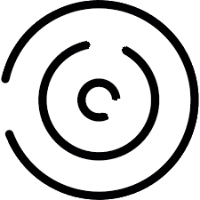
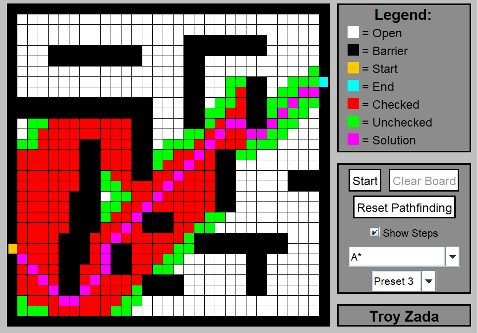

<!-- PROJECT LOGO -->
 

    
    <h3 align="center">Pathfinding Algorithms: Visually compare various shortest path algorithms</h3>
    

        Pathfinding Algorithms provides users with the ability to visually compare four different shortest path algorithms, allowing the benefits and drawbacks of each algorithm to easily be identified.
    

<!-- TABLE OF CONTENTS -->

    
Table of Contents

    <ol>
        <li>
            <a href="#about-the-project">About The Project</a>
        </li>
    </ol>

<!-- ABOUT THE PROJECT -->
## About The Project

    

 

Pathfinding Algorithms helps users understand the purpose behind algorithms and how they operate to drastically improve their overall learnings. For instance, the A* algorithm can determine the shortest distance the fastest but requires the end tile to be known beforehand, while other algorithms, can determine the shortest distance without require any comprehension of the end tile.

Users can manually draw obstacles themselves or choose from one of the preset options. Once a particular algorithm and obstacle is selected, the user can specify if they want to see the visual solution or to just see the final solution.

Visually displaying the solution will individually render the tiles to portray how the algorithm determines the shortest path within the given set of obstacles. Red and green tiles will appear depicting which tiles the algorithm needed to check before reaching the end tile. If no solution exists, a popup message will inform the user that there is no possible path between the start and end tiles. 

The application has several different algorithms:
- Breadth-First Search: Views tiles closest to the start tile, spreading out evenly on all sides
- Depth-First Search: Fully attempts one path until a dead end is reached before moving onto another path
- A*: Calculates a G, H, and F cost for the current tile, being the distances between the start/end tile to the current tile to determine the direction
- Dijkstra: Views tiles closest to the start tile

(<a href="#readme-top">back to top</a>)

